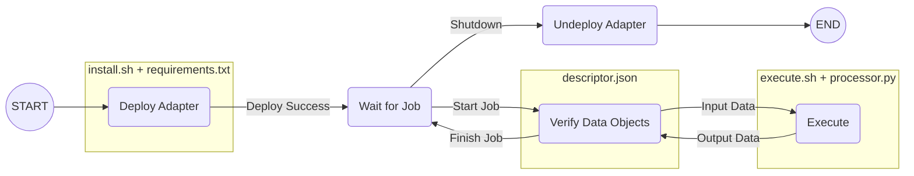

# saas-middleware-sdk

This repository provides the Python implementation of the `saas-middleware` software development kit (SDK). Developers will be able to use this SDK to create applications to interact with a SaaS node, and also create their own SaaS adapter. 

It consists of two main python packages, `saascore` and `saasadapters`.

## `saascore`
This package provides the necessary functions to interact with a SaaS node. For example, to deploy adapters, upload data objects and submit jobs. 

### Keystore
Before interacting with SaaS nodes, it is __required__ for the user to create a Keystore. It is used throughout the SaaS system for authentication/authorisation purposes as well for managing ownership and access rights to data objects. 

The keystore contains the Identity of a user which consists of an ID, name, email and a set of key pairs (public/private pair used for cryptographic operations). Besides an identity, the keystore can also store information in the form of assets. The contents in the keystore would then be encrypted with the help of a password provided by the user.

This package provides a module `saascore.keystore.keystore` with a class to create such a keystore. Examples of assets that the keystore supports can be found in `saas.keystore.assets`. Additionally, the way SaaS handles key pairs and cryptographic operations (encryption and hashing) can be found in `saascore.cryptography`.

Example of creating a Keystore:
```python
from saascore.keystore.keystore import Keystore
from saascore.keystore.assets.credentials import CredentialsAsset, GithubCredentials

# Create the keystore in provided path (defaults to $HOME/.keystore)
keystore = Keystore.create(keystore_path, name, email, password)

# Create a Github credential asset (useful for accessing private Github repositories when deploying adapters)
github_cred = CredentialsAsset[GithubCredentials].create('github-credentials', GithubCredentials)

github_cred.update(repo_url, GithubCredentials(
    username,
    personal_access_token
))

# Add asset to keystore
keystore.update_asset(github_cred)
```

### API 
SaaS node uses REST as its main form of communication via a HTTP API interface. The specifications of the REST interface are written in the [OpenAPI](https://swagger.io/specification/) format and can be found [here](./saascore/api/spec/openapi.yaml).

Sending HTTP requests to SaaS nodes are abstracted into functions and can be accessed by importing from the module `saascore.api.sdk.proxies`. These functions are grouped into classes based on the three main services SaaS node provides i.e. __NodeDB__ (Node Database), __DOR__ (Data Object Repository), __RTI__ (Runtime Infrastructure).

In general, these services can be briefly described as follows:

The __NodeDB__ is a node database for storing persistent records needed by the node to function. In this context, it exposes and provides the user with information regarding nodes in the network. Additionally, it also provides information of all Identities that are known to in network. Users will be able to upload and update their Identity here.

The Data Object Repository (__DOR__) stores and provides access to data objects. Data objects are used as inputs for jobs and are created as outputs after jobs are finished. Besides data objects used for jobs, it also stores information on how to deploy adapters in the form of Git-Processor-Pointers (GPP). The user will be able to upload, download, modify access and retrieve information of such data objects from the nodes.

The Runtime Infrastructure (__RTI__) deploy/undeploy adapters and help execute jobs. It sets up the environment needed for adapters to execute jobs submitted by users (e.g. install dependencies, prepare data objects from DOR, store output into DOR). All of this is handled for the user automatically based on the descriptor of the adapter. The user is only required to specify the adapter (with its configuration) they want to run and ensure the input files exist in the DOR. Users would also be able to retrieve the status of submitted jobs. 

Example of sending requests to a node:
```python
from saascore.api.sdk.proxies import NodeDBProxy, DORProxy, RTIProxy

# Create the proxy object with the IP address of the SaaS node you want to interact with.
db_proxy = NodeDBProxy(node_address)
dor_proxy = DORProxy(node_address)
rti_proxy = RITProxy(node_address)

# Interact with the node by calling methods from the proxy objects
node_info = db_proxy.get_node()
data_objects = dor_proxy.search()
deployed = rti_proxy.get_deployed()
```

To see the list of functions and the parameters required for each of them, refer to the code found in the module `saascore.api.sdk.proxies`.

A full example of a simple application using this module can be found [here](./saascore/api/example/simple_app.py).


## `saasadapters`
This package provides helper functions and an example template for creating a valid SaaS adapters. These are needed for the RTI to successfully deploy such adapters and use them to execute computational jobs. 

### Adapter Structure
A valid adapter should follow a similar folder structure and contain these types of files (with exact file names and in the same directory) as shown below:

```
saas_processor/
├── descriptor.json
├── execute.sh
├── install.sh
├── processor.py
└── requirements.txt
```
The diagram below shows the lifecycle of a adapter and the stages where each of these files are used.



#### Install Script (`install.sh`) + Python Dependencies (`requirements.txt`)
The Install script specifies how to set up the proper environment for the adapter during the deployment stage. This can include installing software, compiling binaries and downloading external dependencies. It runs every time an instance of the adapter is deployed.

Example of Install Script:
```bash
#!/bin/bash

if [ "$1" == "default" ]; then
	echo "Run default configuration"
  python3 -m pip install -r ./requirements.txt
	exit 0

elif [ "$1" == "nscc" ]; then
	echo "Run nscc configuration"
  python3 -m pip install -r ./requirements.txt
	exit 0

else
	exit 1
fi

```

When the script is executed, an argument (value of chosen `configuration`) is passed to the script which specifies how the adapter should be deployed. From the example above, the adapter accepts either `default` or `nscc` as valid configurations, and runs the respective code based on the given argument. 

This is also where python dependencies for the adapter can be installed using the `requirements.txt` file. This file follows the [format](https://pip.pypa.io/en/stable/reference/requirements-file-format/#requirements-file-format) that pip uses. Note that the RTI does not use this file automatically so it has to be added manually into the `install.sh` file by the user. If no python dependencies are required, this file can be omitted.

#### Adapter Descriptor (`descriptor.json`)
A Adapter Descriptor specifies the name, input/output interfaces and configurations of a adapter. 

It is in the form of a JSON file and is structured as follows:

```json
{
  "name": ...,
  "input": [
    ...
  ],
  "output": [
    ...
  ],
  "configurations": [
    ...
  ]
}
```

The input/output interfaces (`input` and `output`) are lists of items that specify the input data consumed and output data produced by the adapter, respectively. This information is used before and after job execution to verify that the correct data objects are submitted and created respectively.

Structure of Input/Output Item:
```json
{
  "name": ...,
  "data_type": ...,
  "data_format": ...
}
```
An item has a name, a data type and data format. `data_type` provides the context of how the data is used (e.g. `AHProfile` is for anthropogenic heat profile). `data_format` is how the data is formatted/encoded (e.g. `csv`).


The `configurations` property is a list of user defined strings that describes the runtime configurations supported by this adapter. They are mainly used in the `install.sh` and `execute.sh` scripts, and affects how the adapter will be deployed and executed.

Example of a Adapter Descriptor:
```json
{
  "name": "test-proc",
  "input": [
    {
      "name": "a",
      "data_type": "JSONObject",
      "data_format": "json"
    },
    {
      "name": "b",
      "data_type": "JSONObject",
      "data_format": "json"
    }
  ],
  "output": [
    {
      "name": "c",
      "data_type": "JSONObject",
      "data_format": "json"
    }
  ],
  "configurations": [
    "default", 
    "nscc"
  ]
}
```

#### Execute Script (`execute.sh`) + Python Script (`processor.py`) 
The Execution script specifies how the adapter should run a given job during the execution stage. It runs every time the adapter executes a job.

Example of Execution Script:
```bash
#!/bin/bash 

if [ "$1" == "default" ]; then
	echo "Run processor.py with default configuration on $2"
	python3 processor.py $2

elif [ "$1" == "nscc" ]; then
	echo "Run processor.py with nscc configuration on $2"
	python3 processor.py $2

else
	exit 1
fi
```

When the script is executed, it is passed two arguments. First, the configuration of the adapter (same value passed to the `install.sh` script) and second, the path to the working directory. The working directory is where the inputs files the job needs will be found and where output files of the job should be written to. From the example above, the path is passed to as an argument to the `processor.py` during execution.

The `processor.py` is where most of the execution logic is written. Note that since the `execute.sh` script is a bash file that the RTI runs during execution, it could actually be used to run anything (e.g. run a compiled binary file, launch an external program, running simple bash commands, etc), and not use the `processor.py` file at all. It is mostly used as a convention for creating SaaS adapters using python. As long as output files are created into the working directory (as provided by the second argument of the `execute.sh` script) and the required triggers are provided (explained in the following section), the job should finish successfully.

### Adapter functions
During the execution stage, the status of the job must be communicated with the RTI so that the RTI can decide if the job has completed successfully. This is done in the form of __triggers__ which are lines sent to the system output (`stdout`) in the form `trigger:{type}:{value}`. RTI would monitor the system output of the execution script for such triggers and react according to the type of trigger received.

Currently, the RTI accepts two kinds of triggers that can be sent during execution of the job, `progress` and `output`. 

The `progress` trigger is mainly used for monitoring purposes for the user as it only shows the progress of the execution script in the form of percentage number (e.g. `80`). The RTI does not do anything when receiving this trigger, other than forwarding its contents to its output.

Example of `progress` trigger:
```
trigger:progress:80
```

The `output` trigger is used to track the creation of output files of the adapters. This trigger is required to be present for each output file that an adapter would produce (as stated in the Adapter Descriptor) for a job to be considered successful.

Example of `output` trigger:
```
trigger:output:c
```

These triggers can be found as helper functions in the module `saasadapters.sdk.helpers` and can be used in the `processor.py`.